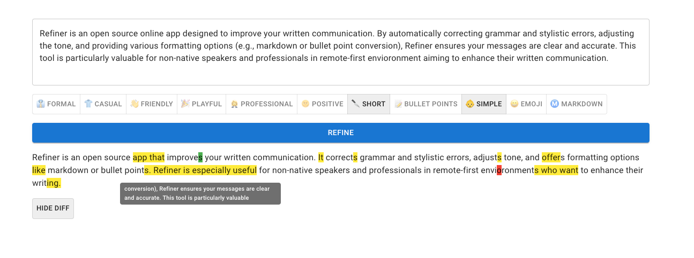

# Refiner

## Introduction

Refiner is an open source online app designed to improve your written communication. By automatically correcting grammar and stylistic errors, adjusting the tone, and providing various formatting options (e.g., markdown or bullet point conversion), Refiner ensures your messages are clear and accurate. This tool is particularly valuable for non-native speakers and remote working professionals aiming to enhance their written communication.



## Features

1. **Grammar and Style Refinement**: Corrects grammatical and stylistic errors.
2. **Tone Adjustment**: Adjusts the tone of the text as needed.
3. **Text Formatting**: Includes markdown formatting and bullet point conversion.
4. **Non-Native Speaker Friendly**: Specially designed to support non-native English speakers in improving their written communication.

## Requirements

1. Node.js v14.0.0 or above
2. An account at OpenAI
3. Docker (optional)

## Installation

Clone the repository:

```bash
git clone https://github.com/imankulov/refiner.git
cd refiner
```

Install the required packages:

```bash
npm install
```

Copy and modify the env file:

```bash
cp env.example .env.local
edit .env.local
```

You will need an OpenAI API key. Create one at https://platform.openai.com/account/api-keys.

(Optional) To run with Docker:

```bash
make build
make run
```

## Usage

Start the server:

```bash
npm run dev
```

Navigate to `localhost:3000` in your browser.

Enter the text you want to refine into the provided field, select your desired settings, and then click 'Refine'. The service will do the rest.

## Licenses

Refiner is an open-source product licensed under MIT. See the LICENSE file for more details.
